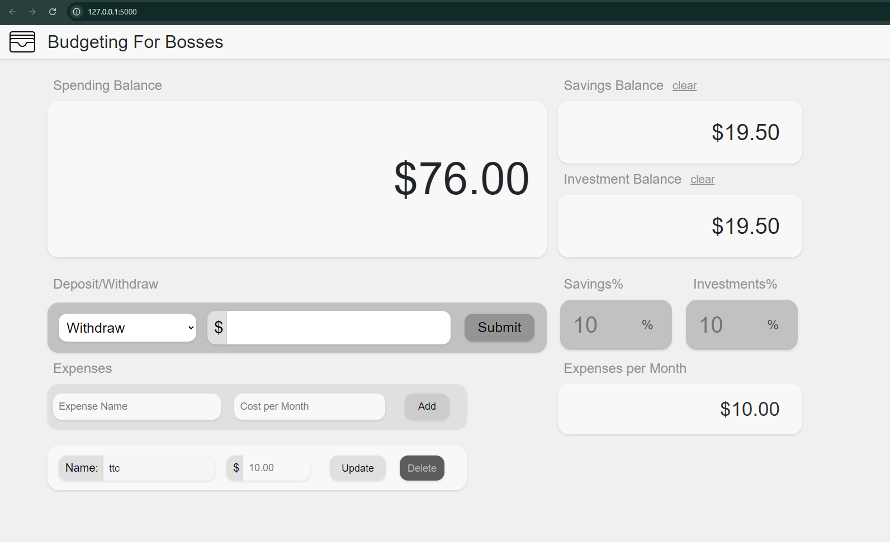

# Budget Expense Tracker
A simple budget expense tracker built using Python, Flask, SQLite, HTML, CSS, and JavaScript. This application allows users to manage their expenses, set budgets, and visualize their spending habits over time.

## ScreenCapture



## Features
Add and Edit Expenses: Easily input new expenses and edit existing ones.
Set Budgets: Define budget limits for different categories and track your spending.
Data Visualization: Visualize your expenses to understand your spending patterns.
Responsive Design: Access the application on various devices with a responsive user interface.

## Technologies Used
Frontend: HTML, CSS, JavaScript

Backend: Python, Flask

Database: SQLite

## Installation
Clone the repository:

```bash
git clone https://github.com/Allenreinoso28/budget-expense-tracker-python.git
```
Navigate to the project directory:

```bash
cd budget-expense-tracker-python
```
Install the required packages:
```bash
pip install -r requirements.txt
```

Run the application:
```bash
python app.py
```
Open your web browser and go to http://127.0.0.1:5000.

## Usage
Make Deposits: Deposit to Paycheck or directly to Savings
Make Withdraws: Withdraw from spending balance
Add Expenses: Click on the "Add Expense" button and fill in the details.
View Expenses: See your expenses listed with options to edit or delete them.
Set Budgets: Define budgets for different categories to manage your spending.


### Contributions are welcome! If you have suggestions for improvements or features, feel free to create a pull request or open an issue.

## License
This project is licensed under the MIT License. See the LICENSE file for more information.

## Contact
If you have any questions or feedback, feel free to reach out to me:

Email: allen.j.reinoso@gmail.com
GitHub: Allenreinoso28
